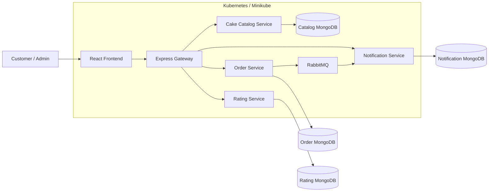

# Cake Delight — Cloud-Native Microservices Application

Cake Delight is a cloud-native online cake ordering application built using a microservices architecture. The system separates cake catalog management, basket/order processing, ratings and reviews, and notifications into independently deployable services.

## Architecture at a glance



## Main components

| Component | Technology | Port | Responsibility |
|---|---|---:|---|
| Frontend | React + Vite + Axios | 80 in container | Customer and admin UI |
| API Gateway | Express Gateway | 3004 | Single API entry point and routing |
| Cake Catalog | Node.js + Express + MongoDB | 3000 | Cake CRUD, filtering and images |
| Order Service | Node.js + Express + MongoDB | 3001 | Basket, checkout and order status |
| Rating Service | Node.js + Express + MongoDB | 3003 | Ratings, reviews and averages |
| Notification Service | Node.js + Express + MongoDB | 3002 | Notification storage and read state |
| RabbitMQ | RabbitMQ | 5672 / 15672 | Asynchronous order-completion event |
| MongoDB | MongoDB 7 | 27017 | Persistent application data |
| Kubernetes | Kubernetes / Minikube | — | Container orchestration and scaling |

## Core business flow

1. The frontend requests the API Gateway.
2. The gateway routes the request to the appropriate microservice.
3. The Cake Catalog Service manages cake information and images.
4. A customer adds a cake to a basket. The Order Service validates the cake by calling the Cake Catalog Service synchronously.
5. Checkout converts the basket into an order and removes the basket.
6. An admin can update the order status.
7. When an order becomes `Completed`, the Order Service publishes an `ORDER_COMPLETED` event to RabbitMQ.
8. The Notification Service consumes that event and creates an unread notification.
9. The frontend retrieves notifications through the gateway.

## API base URL

When deployed with the included Minikube manifests, the API Gateway is exposed as a NodePort.

```text
http://<MINIKUBE_IP>:31958
```
The API-DOC is exposed as:

```text
http://<MINIKUBE_IP>:30080/api-docs
```

The frontend is exposed as:

```text
http://<MINIKUBE_IP>:30080
```

The exact Minikube IP can be obtained with:

```bash
minikube ip
```

## Repository structure

```text
Ricky_CApstonePRoject_Cohort1/
├── Cake_Catalog_Microservice/
├── Order_Microservice/
├── Rating_Microservice/
├── Notification_Microservice/
├── cake-delight-gateway/
├── cake-delight-frontend/
├── k8s/
├── docker-compose.yml
├── deploy-k8s.sh
└── docs/
    ├── API_DOCUMENTATION.md
    ├── DATABASE_SCHEMA.md
    ├── ARCHITECTURE.md
    ├── EVENT_DOCUMENTATION.md
    ├── DEPLOYMENT.md
    ├── DEVELOPMENT.md
    ├── TESTING.md
    └── openapi.yaml
```
## 🎥 End-to-End Demonstration

The following video demonstrates the complete functionality and cloud-native architecture of the **Cake Delight** application, including the customer journey, microservice communication, event-driven notification flow, containerization, and Kubernetes deployment.

**[▶️ View the Project Demonstration Video](https://drive.google.com/file/d/1vAcil2NPXxmKcKGJYZ5SA66LX8gJQFeC/view?usp=sharing)**

### Demonstrated Features

- Cake catalog and filtering
- Shopping basket management
- Checkout and order processing
- Cake ratings and reviews
- API Gateway routing
- Synchronous REST communication
- RabbitMQ asynchronous event communication
- In-app notifications
- Docker containerization
- Kubernetes deployment and service discovery
- Kubernetes scalability configuration

## Running with Docker Compose

From the project root:

```bash
docker compose up --build
```

Main local endpoints:

- Frontend: `http://localhost:5173`
- API Gateway: `http://localhost:3004`
- RabbitMQ management: `http://localhost:15672`
- MongoDB: `mongodb://localhost:27017`

Stop the stack:

```bash
docker compose down
```

## Running with Minikube

The project includes an automated deployment script.

```bash
chmod +x deploy-k8s.sh
./deploy-k8s.sh
```

The script:

1. Points Docker CLI to Minikube's Docker daemon.
2. Removes existing application deployments/services/config maps/PVCs.
3. Builds all application images inside Minikube.
4. Applies all manifests under `k8s/`.
5. Waits for the core deployments to roll out.
6. Prints the frontend and gateway access URLs.

See [`docs/DEPLOYMENT.md`](docs/DEPLOYMENT.md) for details.

## Validation

The services use `express-validator` for request validation. Examples include:

- Cake name, description and category are required.
- Cake price must be positive.
- Cake availability must be boolean.
- Basket cake IDs and basket IDs must be valid MongoDB IDs.
- Basket quantities must be at least 1.
- Checkout email must be valid.
- Checkout phone number is validated for India.
- Order status is restricted to `Pending`, `Processing`, `Completed`, or `Cancelled`.
- Ratings must be between 1 and 5.
- Notification IDs and email parameters are validated.

## Observability

Each backend service includes request logging and Winston-based application logging. Service log files are stored under each microservice's `logs/` directory.

Typical log categories include:

- Service startup
- Database connection
- HTTP requests
- RabbitMQ connection
- Event publication
- Event consumption
- Validation/business-operation failures
- Internal errors

## Important configuration

Environment variables are used for service-to-service and database configuration. Do not commit real credentials or secrets.

Typical variables include:

```text
MONGO_URL
MONGO_URI
RABBITMQ_URL
CAKE_CATALOG_URL
VITE_API_BASE_URL
```

The committed example configuration should be treated as development-only configuration.

## Documentation index

- [API Documentation](docs/API_DOCUMENTATION.md)
- [Database Schema](docs/DATABASE_SCHEMA.md)
- [System Architecture](docs/ARCHITECTURE.md)
- [RabbitMQ Events](docs/EVENT_DOCUMENTATION.md)
- [Deployment Guide](docs/DEPLOYMENT.md)
- [Development Guide](docs/DEVELOPMENT.md)
- [Testing Guide](docs/TESTING.md)
- [OpenAPI 3.0 Specification](docs/openapi.yaml)
