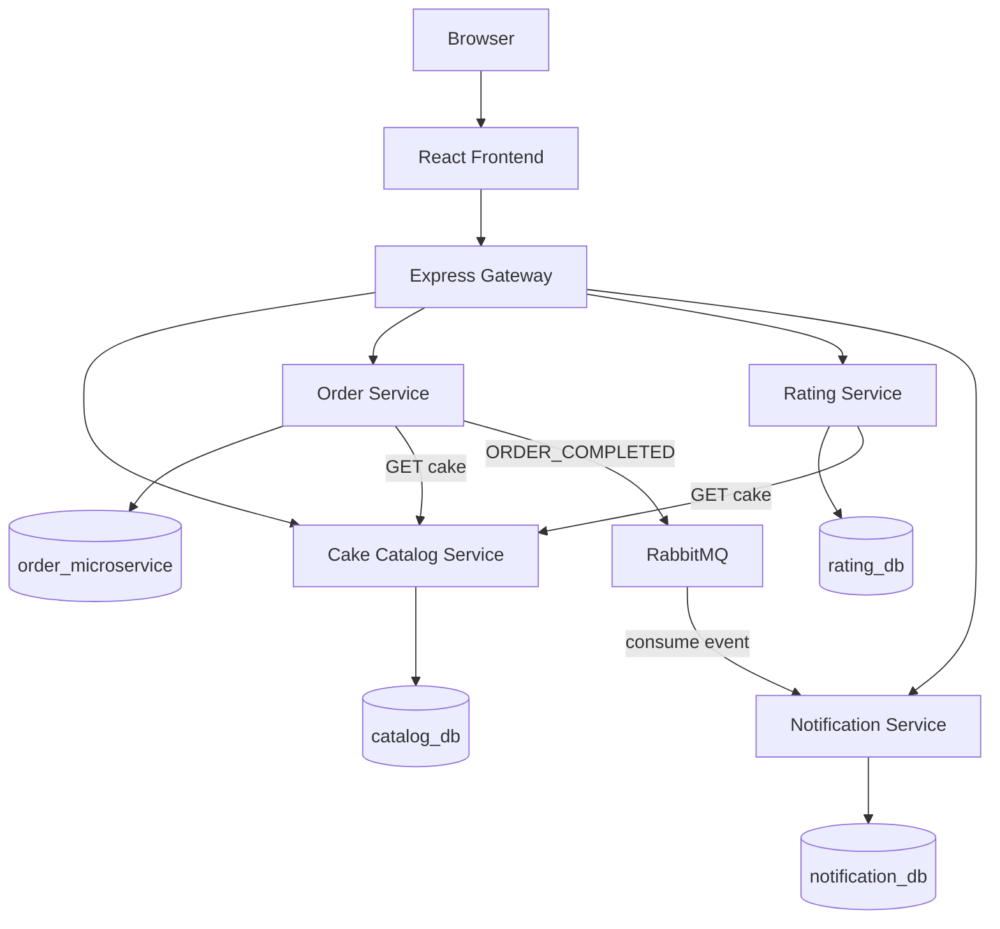

# System Architecture

## 1. Architectural style

Cake Delight follows a microservices architecture with:

- Independent Node.js/Express services
- API Gateway pattern
- Database-per-service separation
- Synchronous REST communication for immediate validation
- Asynchronous RabbitMQ communication for order-completion notifications
- Containerized deployment
- Kubernetes orchestration
- Horizontal Pod Autoscaling for selected services

## 2. Component diagram



## 3. API Gateway

Express Gateway is the single public API entry point.

Responsibilities:

- Route requests by path.
- Apply CORS policies.
- Log API requests.
- Proxy traffic to internal services.
- Keep internal service ports away from the frontend.

Gateway routes:

```text
/cakes            -> cake-catalog:3000
/cake-images      -> cake-catalog:3000
/baskets          -> order-service:3001
/orders           -> order-service:3001
/ratings          -> rating-service:3003
/notifications    -> notification-service:3002
```

## 4. Synchronous communication

Synchronous communication is used where the caller immediately needs a result.

### Basket validation

```text
Frontend
   |
   v
Gateway
   |
   v
Order Service
   |
   | GET /cakes/{cakeId}
   v
Cake Catalog
   |
   v
Cake exists + availability
   |
   v
Order Service
```

The Order Service does not blindly trust a cake ID supplied by the frontend.

### Rating validation

The Rating Service also verifies the cake through the Cake Catalog Service before storing a rating.

## 5. Asynchronous communication

RabbitMQ is used for the `ORDER_COMPLETED` event.

```text
Order Service
     |
     | publish
     v
order_completed_queue
     |
     | consume
     v
Notification Service
     |
     v
Notification MongoDB
```

This prevents the Order Service from having to synchronously create the notification itself.

## 6. Data ownership

Each service owns its own MongoDB database/collections. Other services access business information through service APIs or events rather than direct database access.

## 7. Container architecture

The Docker Compose environment contains:

```text
mongodb
rabbitmq
cake-catalog
order-service
notification-service
rating-service
gateway
frontend
```

Kubernetes deploys the same logical components as Deployments/Services, with persistent volumes for MongoDB and RabbitMQ.

## 8. Scaling

Horizontal Pod Autoscalers are configured for:

- `order-service`: 1–5 replicas, target CPU 70%
- `cake-catalog`: 1–5 replicas, target CPU 80%

The Kubernetes manifests also specify CPU/memory requests and limits for the backend workloads.

## 9. Frontend architecture

The frontend uses React Router for customer and admin pages.

Main customer routes:

```text
/
 /cakes/:id
 /basket/:basketId
 /checkout/:basketId
 /order/:orderId
 /orders
 /notifications
```

Main admin routes:

```text
/admin
/admin/cakes
/admin/cakes/add
/admin/cakes/:id/edit
/admin/orders
```

Interactive API documentation is available at:

```text
/api-docs
```

## 10. Design principles demonstrated

- Service isolation
- Database ownership
- API gateway
- Synchronous service-to-service communication
- Event-driven communication
- Containerization
- Kubernetes deployment
- Persistent storage
- Horizontal scaling
- Validation
- Centralized request/application logging
