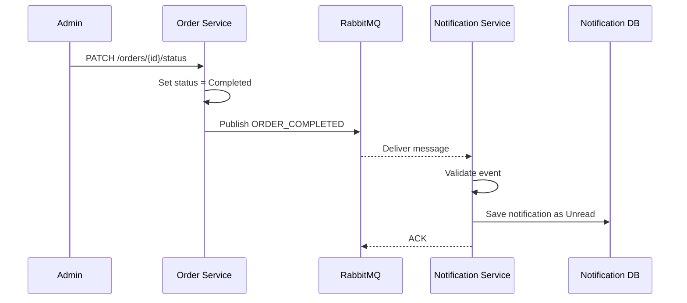

# Event Documentation

## RabbitMQ

RabbitMQ is used for asynchronous communication between the Order Service and Notification Service.

### Queue

```text
order_completed_queue
```

The queue is declared as durable.

## ORDER_COMPLETED

### Producer

```text
Order Service
```

### Consumer

```text
Notification Service
```

### Trigger

The event is published when an order's status is changed to:

```text
Completed
```

### Event payload

```json
{
  "event": "ORDER_COMPLETED",
  "orderId": "665f...",
  "customerName": "Customer Name",
  "email": "customer@example.com",
  "totalPrice": 800
}
```

### Field definitions

| Field | Type | Required | Description |
|---|---|---|---|
| `event` | string | Yes | Must be `ORDER_COMPLETED` |
| `orderId` | string | Yes | Completed order ID |
| `customerName` | string | Yes | Customer name |
| `email` | string | Yes | Customer email |
| `totalPrice` | number | Yes | Final order amount, >= 0 |

## Event processing

The Notification Service:

1. Receives the message.
2. Parses the JSON payload.
3. Validates the event type and required fields.
4. Builds a customer notification message.
5. Stores the notification in MongoDB with status `Unread`.
6. Acknowledges the RabbitMQ message.

Invalid events are rejected and are not requeued.

## Reliability behavior

Both Order Service and Notification Service implement RabbitMQ connection recovery. If a connection closes, the service resets its channel and retries the connection after a delay.

The producer sends persistent messages and uses a durable queue.

## Business sequence


